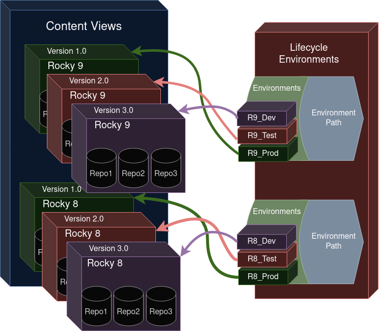

# Foreman With Custom Certificates 

Foreman requires quite a bit of configuration before the first machine can be registered and update against it.

# Setup SSL Certificates

* DNS Providers
    - [Google Cloud DNS](../letsencrypt/google-dns.md)
    - [Cloudflare](../letsencrypt/cloudflare.md)
    - If another DNS provider used follow the instructions provided by Certbot and/or the DNS provider.

# Install Foreman

Follow the [Foreman Installation Guide](./install.md) for Rocky 8.

# Configure Foreman

Foreman requires quite a bit of configuration to be useful. This guide may miss some steps.

### Set Certificate Permissions

> **NOTE:** Depending on your DNS provider the paths provided may change.

The `foreman-proxy` service needs permissions to read supplied certificates.

```
FQDN="foreman.smurf.codes"
CERT_PATH="/etc/letsencrypt/live/$FQDN"

setfacl -R -m u:foreman:rx "$CERT_PATH/../.."
setfacl -R -m u:foreman-proxy:rx "$CERT_PATH/../.."
```

## Configure Repositories and Lifecycles

### Repositories and Product

#### Increase Sync Timeout

Increasing the sync timeout will prevent large packages from causing the repo sync to fail.

Administer > settings > Content > Sync Connection Timeout > 600 Seconds

#### Add Rocky Product

Products are simply groups of repositories.

Create a new product with the name "Rocky 9"

#### Add Repositories

Navigate to the added product and add the following repositories.

1. [Rocky 9](repos/rocky9.md)
2. [Rocky 9 AppStream](repos/rocky9-appstream.md)
2. [Rocky 9 Extras (required for epel)](repos/rocky9-appstream.md)


### Lifecycle Management

At first lifecycle management in Foreman may seem overly complicated. This chart concisely explains how lifecycle paths, life cycle environments, content views and repositores interact.



#### Add Lifecycle Environments

Lifecycle environments are key to managing pinned versions of packages in Foreman. Lifecycle environments are assigned to content views.

1. Content > Lifecycle > Lifecycle Environments
2. Create Environment Path named `R9_Dev`
3. Add New Environment named `R9_Test` with the parent of `R9_Dev`
4. Add New Environment named `R9_Prod` with the parent of `R9_Test`

#### Add Content Views

Content views are **snapshots** of sets of repositories.

1. Content > Lifecycle > Content Views
2. Click **Create content view**
3. Name the Content View `Rocky 9`
4. Add the Rocky 9 repositories that were added above.

